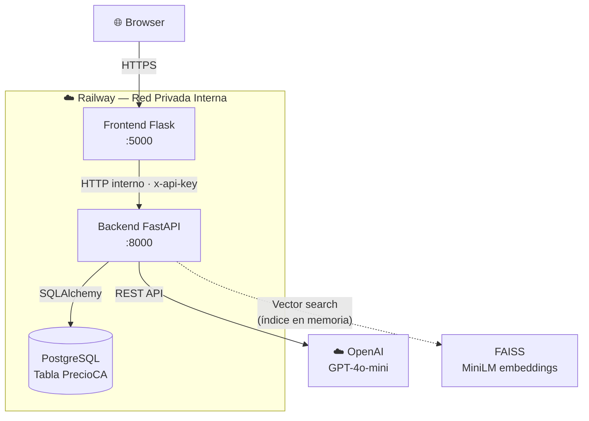
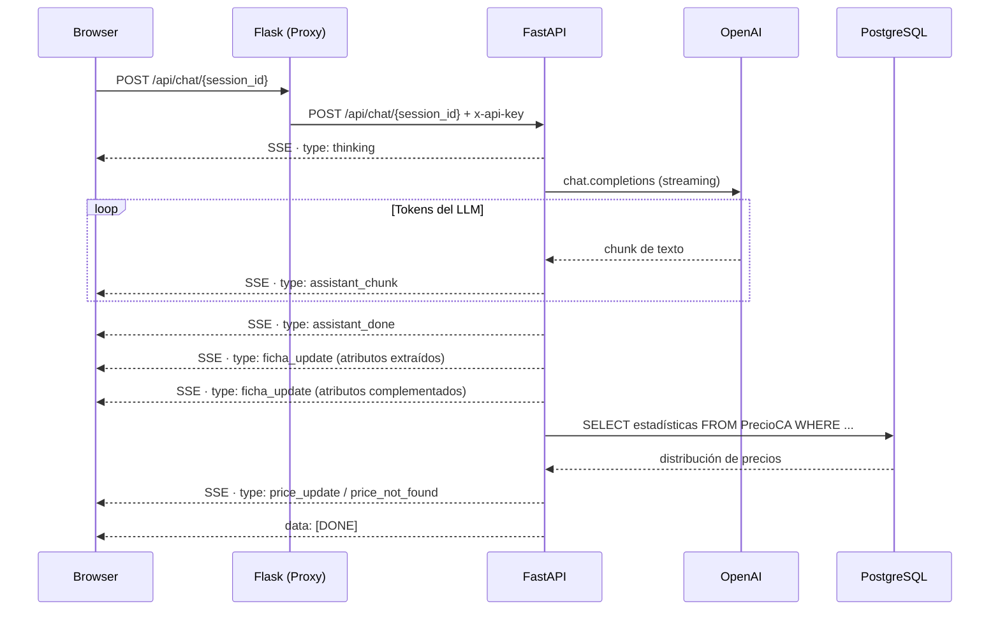
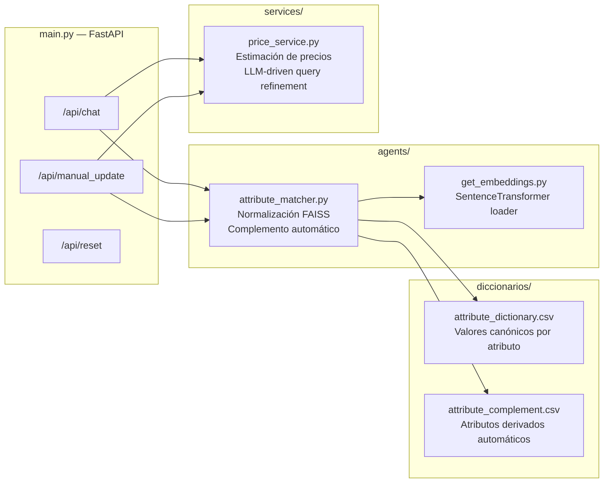
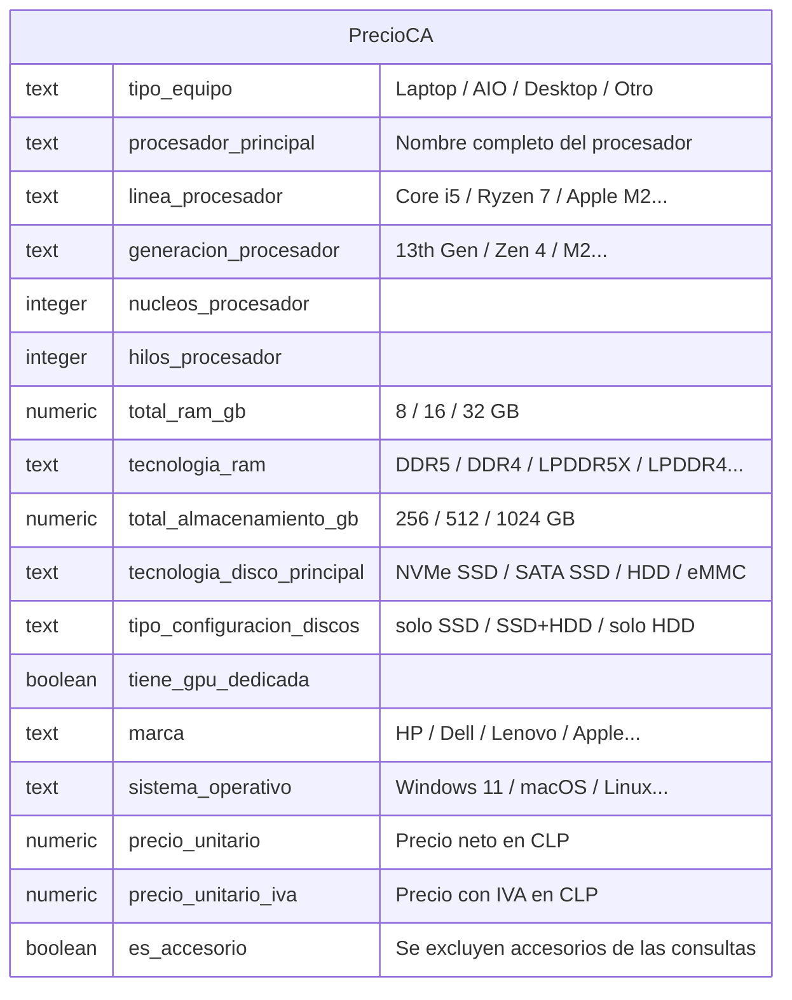
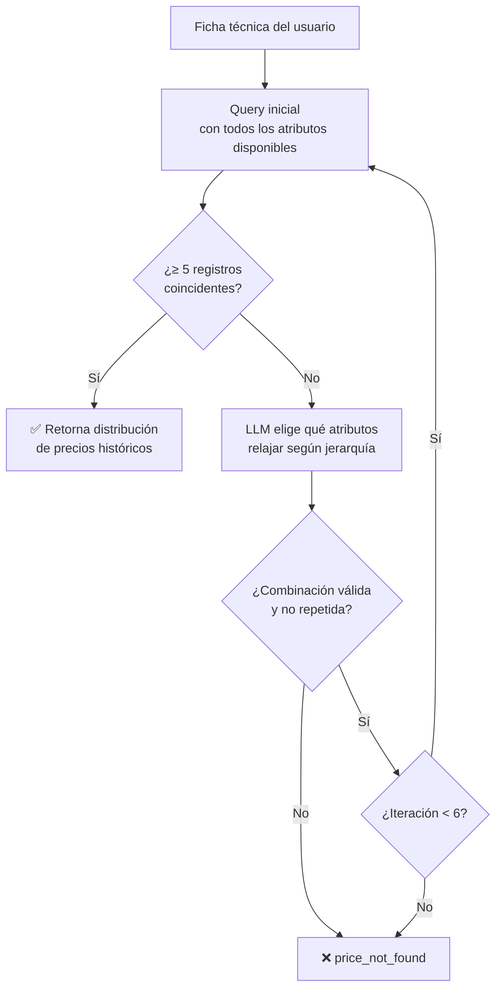

# AIChileCompra — Backend

API REST construida con **FastAPI (Python)** que actúa como núcleo inteligente del asistente de especificación técnica para el catálogo Compra Ágil. Procesa mensajes en lenguaje natural, extrae y estructura atributos de ficha técnica, y estima precios de referencia consultando datos históricos reales de compras públicas.

---

## Stack tecnológico

| Capa | Tecnología |
|---|---|
| Framework API | FastAPI + Uvicorn |
| LLM | OpenAI GPT-4o-mini |
| Búsqueda semántica | FAISS + `paraphrase-multilingual-MiniLM-L12-v2` |
| Base de datos | PostgreSQL (Railway) |
| ORM / queries | SQLAlchemy (Core) |
| Streaming | Server-Sent Events (SSE) |
| Contenerización | Docker |
| Despliegue | Railway |

---

## Arquitectura general



El backend **no tiene dominio público expuesto**: solo el frontend puede alcanzarlo mediante la red interna de Railway, eliminando cualquier acceso externo directo.

---

## Endpoints

Todos los endpoints requieren el header `x-api-key` y retornan un stream `text/event-stream` (SSE).

| Método | Ruta | Descripción |
|---|---|---|
| `POST` | `/api/chat/{session_id}` | Procesa un mensaje del usuario y actualiza la ficha |
| `POST` | `/api/manual_update/{session_id}` | Aplica una edición manual de atributo |
| `POST` | `/api/reset/{session_id}` | Reinicia el estado de la sesión |

---

## Flujo de una petición (SSE)



---

## Módulos internos



### `agents/attribute_matcher.py`
Carga dos CSVs con el diccionario de atributos y las reglas de complemento. Para cada atributo editable construye un índice FAISS con embeddings de los valores canónicos, permitiendo normalizar valores escritos en lenguaje natural por similitud semántica. El complemento infiere automáticamente atributos derivados: dado un `procesador_principal`, extrae `linea_procesador`, `generacion_procesador`, `nucleos_procesador`, `hilos_procesador` y `frecuencia_turbo_procesador_mhz`.

### `services/price_service.py`
Consulta la tabla `PrecioCA` en PostgreSQL con filtros dinámicos sobre los atributos de la ficha. Si la consulta inicial no retorna suficientes registros, invoca al LLM para reformular la query relajando atributos según una jerarquía de especificidad (hasta 6 iteraciones).

---

## Modelo de datos — tabla `PrecioCA`

Cada fila representa una orden de compra real del catálogo Compra Ágil.



---

## Lógica de estimación de precios



**Jerarquía de especificidad del procesador:**

`procesador_principal` → `linea_procesador + generacion_procesador` → `nucleos_procesador` → _(sin procesador)_

---

## Variables de entorno

```env
OPENAI_API_KEY=           # API key de OpenAI
OPENAI_MODEL=gpt-4o-mini  # Modelo LLM
EMBEDDING_MODEL=paraphrase-multilingual-MiniLM-L12-v2
DATABASE_URL=             # Connection string PostgreSQL (interno Railway)
FRONTEND_API_KEY=         # Clave compartida con el frontend para autenticación
ALLOWED_ORIGINS=          # URL pública del frontend (CORS)
FAISS_CACHE_DIR=./cache/faiss_dict
TEMPERATURE=0.2
SIMILARITY_THRESHOLD=0.82
PORT=8000
```

---

## Ejecución local

```bash
cd MVP1-AIChileCompra-backend
python -m venv venv
venv\Scripts\activate        # Windows
source venv/bin/activate     # macOS / Linux
pip install -r requirements.txt

# Crear .env con las variables requeridas
uvicorn main:app --reload --port 8000
```

## Despliegue (Railway)

Railway detecta el `Dockerfile` automáticamente. Las variables de entorno se configuran en **Railway → Backend service → Variables**. El servicio no necesita dominio público habilitado: opera exclusivamente dentro de la red privada interna de Railway.
